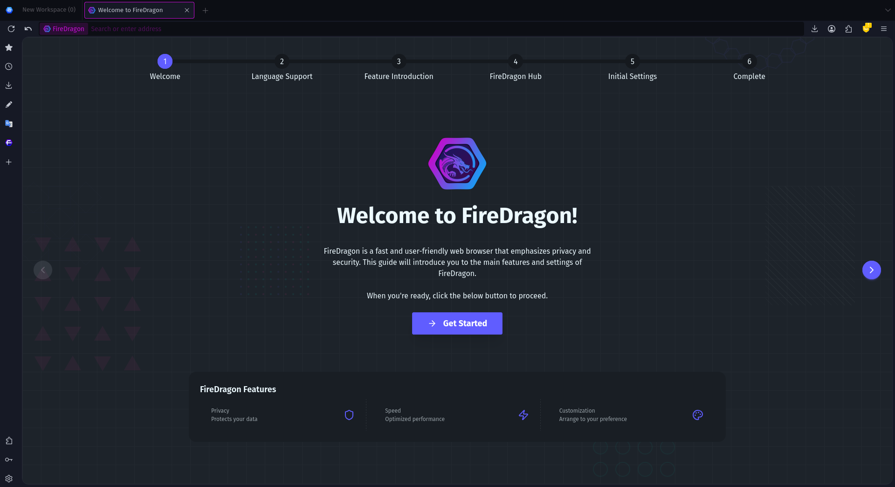
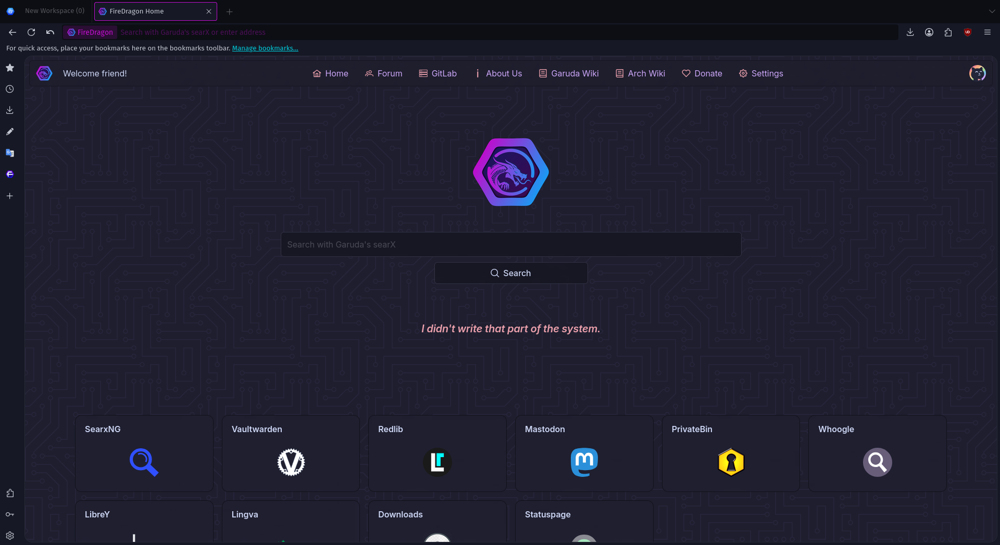
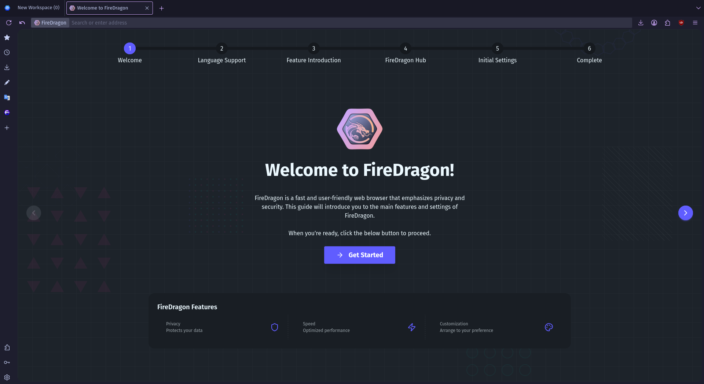
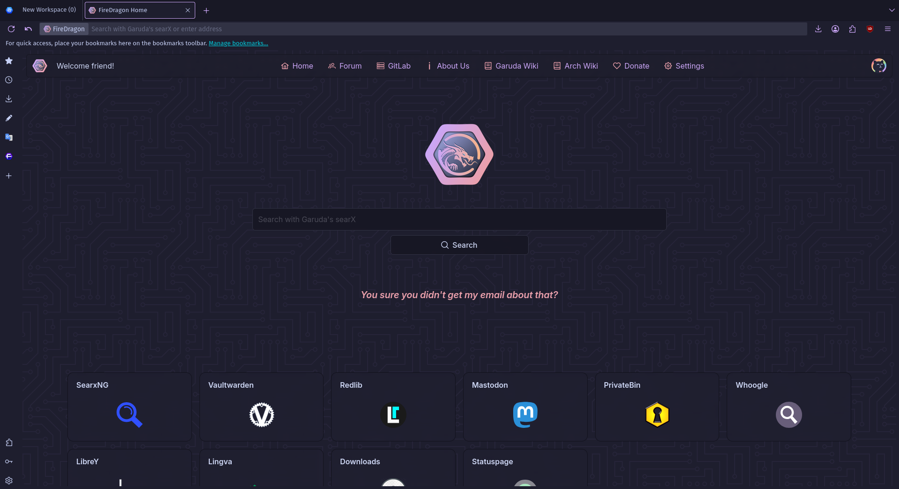

# FireDragon 12

This repository contains the source of FireDragon version 12 based on the new Floorp 12 build system.

## Downloads

Downloads are available on the [Releases page in GitLab](https://gitlab.com/garuda-linux/firedragon/firedragon12/-/releases#downloads).

## Support

Documentation is available on [our website](https://firedragon.garudalinux.org/).

For additional help look in the [Garuda Linux forum](https://forum.garudalinux.org/).

## [FireDragon Browser Documentation](./docs/README.md)
