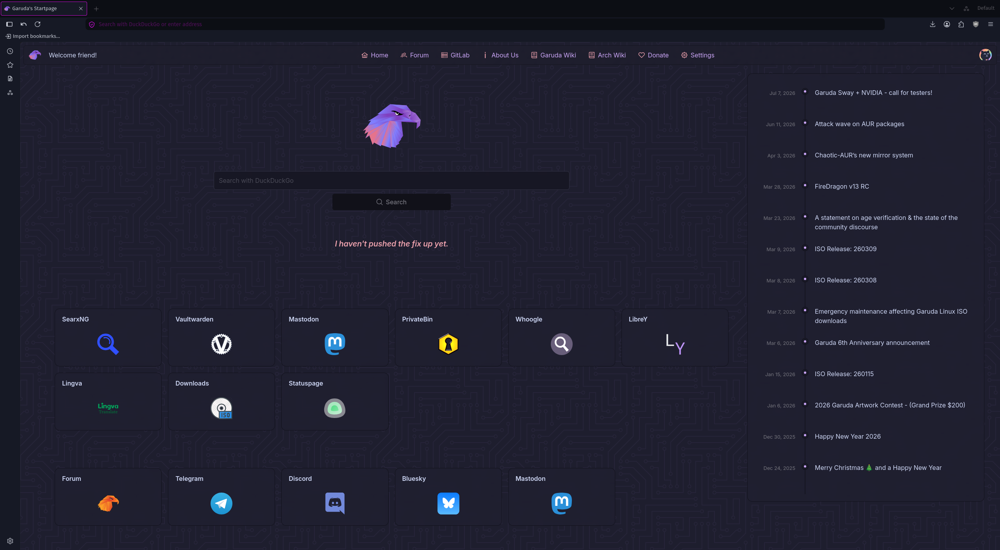
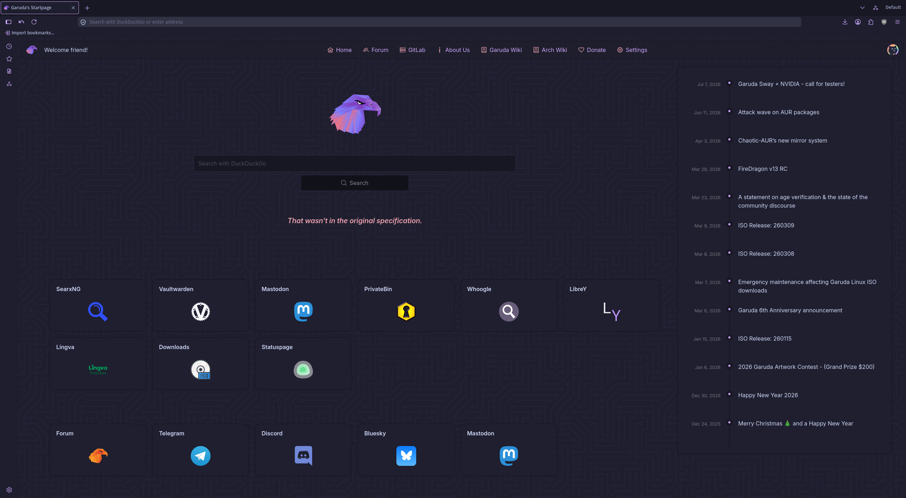

# FireDragon v13

[](https://gitlab.com/garuda-linux/firedragon/firedragon13/-/releases)
[](https://hosted.weblate.org/engage/firedragon13/)

**FireDragon is a cross-platform, feature-rich and privacy-focused web browser**

FireDragon is based on Firefox with privacy-focused patches and settings from LibreWolf and adds opinionated default settings to improve the out-of-the-box experience and user-friendliness:

- Dr460nized & Catpuccin editions to visually integrate with Garuda Linux Dr460nized & Mokka respectively
- uBlock Origin, Dark Reader & Flagfox Add-Ons installed by default
- Firefox Sync is enabled by default using a custom Garuda Linux sync server
- [Lepton](https://github.com/black7375/Firefox-UI-Fix/#readme) skin with custom default configuration

## Screenshots





## Download / Installation

### Linux

FireDragon is officially available in the Arch Linux AUR, Chaotic AUR & Garuda Linux repository.

Otherwise, the Linux tarball can be downloaded on the [Releases](https://gitlab.com/garuda-linux/firedragon/firedragon13/-/releases/) page.

### Windows

The Windows installer can be downloaded on the [Releases](https://gitlab.com/garuda-linux/firedragon/firedragon13/-/releases/) page.

### MacOS

The macOS installer can be downloaded on the [Releases](https://gitlab.com/garuda-linux/firedragon/firedragon13/-/releases/) page.

## Contributing

### Development

First install the required dependencies:

```shell
pnpm install
```

Afterwards you can start the browser in development mode using:

```shell
pnpm make dev
```

To release a new version, update the version in `package.json` and run:

```shell
pnpm make release
```

### Translations

Translations for FireDragon v13 can be easily submitted using [Weblate](https://hosted.weblate.org/engage/firedragon13/):

[](https://hosted.weblate.org/engage/firedragon13/)
